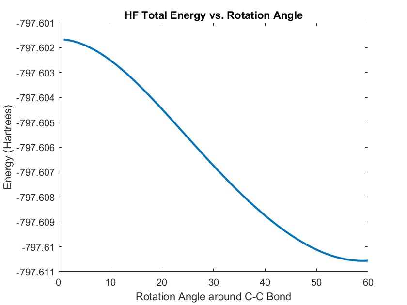

## Psi4-MATLAB Molecular Dynamics Simulation Workflow  

### Introduction
In this example, we show how [Psi4](https://psicode.org/) [1], an open-source suite of ab initio quantum chemistry programs, is used for molecular dynamics (MD) simulations. Psi4 is distributed under the GNU Lesser General Public License version 3, [LGPL-3.0](https://psicode.org/psi4manual/master/introduction.html#license).
This workflow starts with a single molecular structure input, rotates it around a C-C bond, and calculates the molecular energy at the desired theory level at each time step.  The output of the Psi4 computations is then processed in MATLAB to extract data and to build a single .mat file for further analysis.  

### Usage 
Simply run the MATLAB® live script 
> 'MATLAB_Psi4_MD_Simulation.mlx'

This examples requires MATLAB and Bioinformatics Toolbox to run.

### Psi4 Installation
Psi4 can be installed from this [source](https://psicode.org/installs/v17/). You can download standalone command-line installer; or use conda package manager; or build from source using tools and dependencies from conda. Python is included, so you can choose the version you want, regardless of any you have. Make sure to check versions of Python compatible with MATLAB products by Release: [Python Compatibility](https://www.mathworks.com/support/requirements/python-compatibility.html). 

### Input molecule in sdf format and convert to xyz
We use [penicillamine](https://pubchem.ncbi.nlm.nih.gov/compound/Penicillamine) for this example. Penicillamine is a FDA approved chelating agent used to decrease copper stores in Wilson disease. The initial configuration is the distorted molecular geometry due to 60 degrees rotation around the C5-C6 single bond. The final optimized geometry is also visualized here using [Molviewer](https://www.mathworks.com/help/bioinfo/ref/molviewer.html) for comparison. 

## Set up the MD simulations
Refer to Psi4 documentation for [Single-Point Energy](https://psicode.org/psi4manual/master/energy.html) setup. In this example Hartree–Fock (HF) self consistent field (SCF) theory level is used with cc-pvtz [basis set](https://psicode.org/psi4manual/master/basissets.html). The MD simulations are done when the molecule is rotated around C5-C6 single bond (z-axis). Molviewer is used to identify the indices of the rotating atoms. The generated xyz and Python input files can be stored in dedicated folders, for which the paths should be given.

## Generate the MD configurations and running the Psi4 simulations
Since the C5-C6 bond is initially set as the intermolecular z-axis, we can use MATLAB's built-in rotation matrix function, [rotz](https://www.mathworks.com/help/phased/ref/rotz.html), to generate the new configurations for this structural transformation. 
> 'ZRotate_Molecule.m' 

is the function that takes in the initial configuration saves the rotated geometry as xyz file in the xyzpath folder. 
> 'Psi4_py_input_builder.m' 

builds the python script to run the Psi4 calculations. The output is overwritten in the 'Psi4_Output.dat' datafile for further processes.
> 'Get_Atomic_Numbers.m' 

extracts the atomic numbers and atomic symbols from the Psi4 output. "Get_Atomic_Geometries" and 'Get_Total_Energy' extracts the atomic coordinates and the computed energy at each time step, respectively.

All extracted variables can then be saved in one '.mat' data file for future work. 

## Results
The above figure shows the total energy vs. the rotation angle. The [steric effect](https://www.sciencedirect.com/topics/chemistry/steric-effect) in the initial configuration explains the observation of the high starting energy during the MD simulation. This energy monotonically decreases when the conformational restriction is removed during the simulation, until the structure reaches its minimum energy.   

We can store the conformational structures during the simulation by calling the 'Trajcetory' function. The generated XYZ file can be then viewed in Molviewer. Each snapshot of the molecular configurations can be viewed by selecting the corresponding input number from the right corner of the lower panel.

## References
[1]  “Psi4: An open-source ab initio electronic structure program,” J. M. Turney, A. C. Simmonett, R. M. Parrish, E. G. Hohenstein, F. Evangelista, J. T. Fermann, B. J. Mintz, L. A. Burns, J. J. Wilke, M. L. Abrams, N. J. Russ, M. L. Leininger, C. L. Janssen, E. T. Seidl, W. D. Allen, H. F. Schaefer, R. A. King, E. F. Valeev, C. D. Sherrill, and T. D. Crawford, WIREs Comput. Mol. Sci. 2, 556 (2012). (doi: 10.1002/wcms.93).
